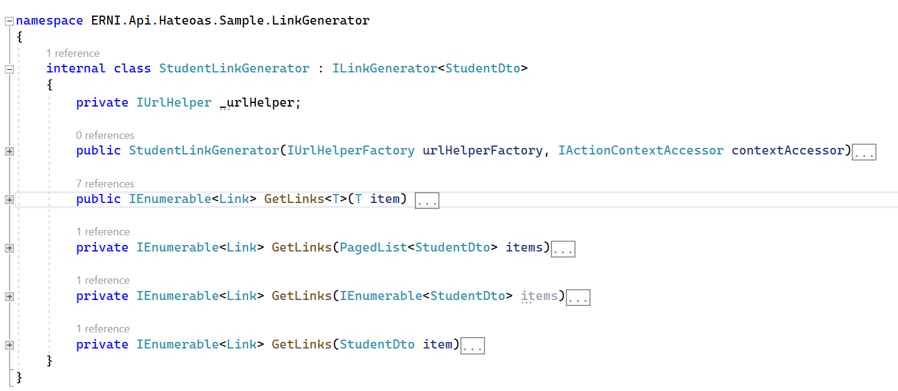
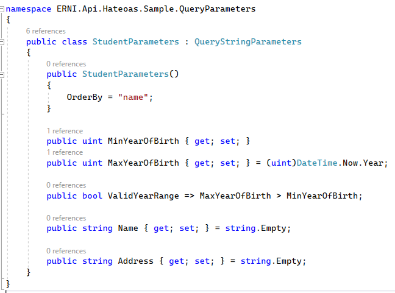
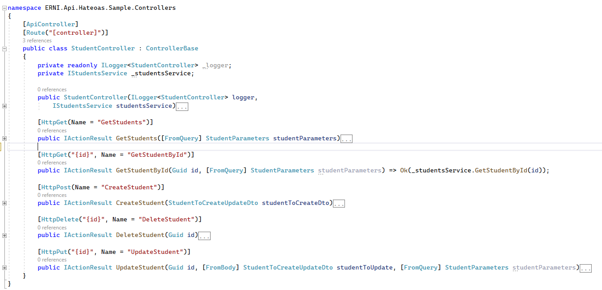
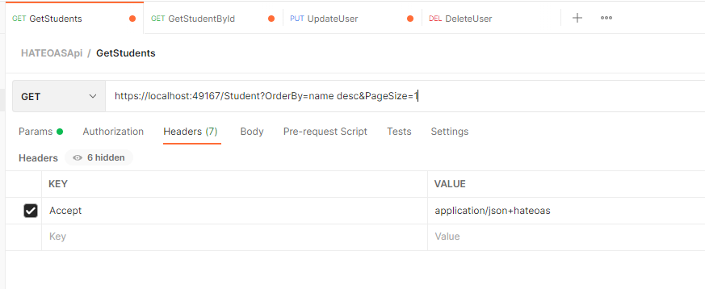
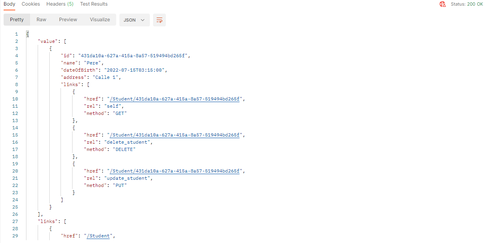
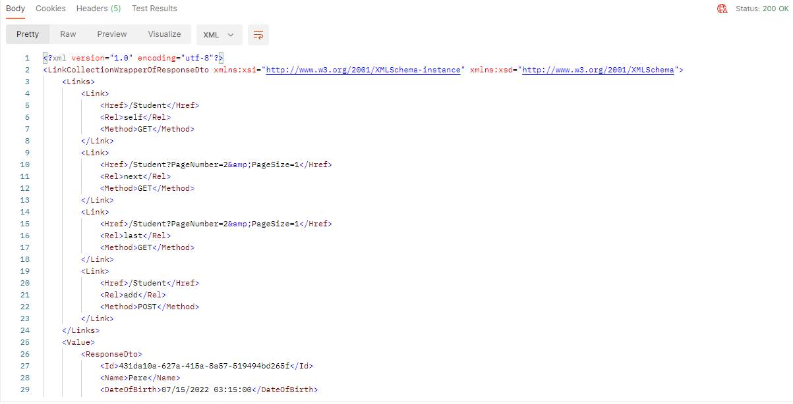

# About ERNI Api Hateoas

ERNI Academy Hateoas Api boilerplate to start a Hateoas Api.

<!-- ALL-CONTRIBUTORS-BADGE:START - Do not remove or modify this section -->
[](#contributors)
<!-- ALL-CONTRIBUTORS-BADGE:END -->

## Built With

This boilerplate is using the following technologies:

- [Net 6.0](https://docs.microsoft.com/en-us/dotnet/core/whats-new/dotnet-6)


## Getting Started

This boilerplate implements [Hateoas](https://docs.microsoft.com/en-us/azure/architecture/best-practices/api-design#use-hateoas-to-enable-navigation-to-related-resources) and is based on a Class library created on .Net 6. 

The application supports the **application/json+hateoas** and **application/xml+hateoas** Api requests headers. This results on getting the full links when performing an http request.

## Prerequisites

To run and play with the boilerplates you need to install the following ide:

* Visual Studio 2022

It also uses Docker to deploy the Sample Api:

* [Docker](https://docs.docker.com/desktop/windows/install/)

## Installation

Installation instructions Erni Api Hateoas by running:

1. Clone the repo

   ```sh
   https://github.com/ERNI-Academy/asset-restfullapi-hateoas.git
   ```

2. Start docker

3. Restore packages

4. Build the application

## Project Structure

### The project contains the following projects

* **Erni.Api.Hateoas.Sample**: this project contains a Sample Api that uses the Core functionality.
* **Erni.Api.Hateoas.**: this project contains the main functionalities to get a functional Hateoas Api.

### The folder structure

. \
├── **Erni.Mobile.Hateoas** \
 &nbsp;&emsp;├── 📁 Dto: Contains all data transfer objects \
 &nbsp;&emsp;│&emsp;&emsp;└── 📄 Link.cs: Base class for Links generations. \
 &nbsp;&emsp;│&emsp;&emsp;└── 📄 LinkCollectionWrapper.cs: Wrapper class for Links. \
 &nbsp;&emsp;│&emsp;&emsp;└── 📄 LinkResourceBase.cs: Base class for LinkCollectionWrapper. \
 &nbsp;&emsp;│&emsp;&emsp;└── 📄 PagedList.cs: Base class to implement the paged list functionality. \
 &nbsp;&emsp;│&emsp;&emsp;└── 📄 PaginationFilter.cs: Class for filtering results. \
 &nbsp;&emsp;│&emsp;&emsp;└── 📄 QueryStringParameters.cs: Class for query string parameters. \
 &nbsp;&emsp;│&emsp;&emsp;└── 📄 ResponseDto.cs: Dynamic class to generate the Api responses. \
 &nbsp;&emsp;├── 📂 Extensions: Contains all custom extension \
 &nbsp;&emsp;│&emsp;&emsp;└── 📄 ServicesExtension.cs: Class that manages dependency injection. \
 &nbsp;&emsp;├── 📂 Formatter: Contains all custom formatters \
 &nbsp;&emsp;│&emsp;&emsp;├── 📄 JsonHateoasFormatter.cs: Class responsible to customize the json output format when Hateoas needs to be implemented. \
 &nbsp;&emsp;│&emsp;&emsp;├── 📄 XmlHateoasFormatter.cs: Class responsible to customize the xml output format when Hateoas needs to be implemented. \
 &nbsp;&emsp;├── 📂 Services: Contains all services that the application uses \
 &nbsp;&emsp;│&emsp;&emsp;└── 📄 DataShaper.cs: Shapes the data to fullfill the query filters. \
 &nbsp;&emsp;│&emsp;&emsp;└── 📄 IDataShaper.cs: Interface for DataShaper class. \
 &nbsp;&emsp;│&emsp;&emsp;└── 📄 ILinkGenerator.cs: Interface to be implemented for the Links generators. \
 &nbsp;&emsp;│&emsp;&emsp;└── 📄 ISortHelper.cs: Interface for SortHelper. \
 &nbsp;&emsp;│&emsp;&emsp;└── 📄 SortHelper.cs: Sorts the data to fullfill the query filters.

## How to use it

1. Create your own API project.

2. Add reference to ERNI.Api.Hateoas project.

3. Call the AddHateoas extension method to register all the required services and formatters on your Program.cs.

This will get all required files from your project

```csharp
builder.Services.AddControllers().AddHateoas();
```
In case you have a multiprojects solution and you have the required files out of the main project then:
```csharp
var assemblies = new[]
{
   Assembley1, 
   Assembley2
   ...
};
builder.Services.AddControllers().AddHateoas(assemblies);
```

4. Implement the ILinkGenerator<> interface for all the Dtos that must implement the Links functionality in their responses. See the example attached:

.

5. Implement the classes inheriting from QueryStringParameters needed for your endpoints and dtos logic. See the example attached:

.

6. Your controllers endpoints need to receive the this QueryParameters class as they are going to be used automatically on the Formatters.

.

7. Formatters will intercept and format the Responses automatically when a request is performed with the Header **Accept** - **application/json+hateoas** or **Accept** - **application/xml+hateoas**.
 
Once your sample app is up and running, an Api is listening on the configured port.
Then, a query can be perfomed. Let's see the following example:

.

The Header **Accept** - **application/json+hateoas** could be also **Accept** - **application/xml+hateoas**.

Then responses would look like:

* For Json

.

* For Xml

.


## Contributing

Please see our [Contribution Guide](CONTRIBUTING.md) to learn how to contribute.

## License


(LICENSE) © 2022 [ERNI - Swiss Software Engineering](https://www.betterask.erni)

## Code of conduct

Please see our [Code of Conduct](CODE_OF_CONDUCT.md)

## Stats

Check [https://repobeats.axiom.co/](https://repobeats.axiom.co/) for the right URL

## Follow us

[](https://www.twitter.com/ERNI)
[](https://www.twitch.tv/erni_academy)
[](https://www.youtube.com/channel/UCkdDcxjml85-Ydn7Dc577WQ)
[](https://www.linkedin.com/company/erni)

## Contact

📧 [esp-services@betterask.erni](mailto:esp-services@betterask.erni)

## Contributors ✨

Thanks goes to these wonderful people ([emoji key](https://allcontributors.org/docs/en/emoji-key)):

<!-- ALL-CONTRIBUTORS-LIST:START - Do not remove or modify this section -->
<!-- prettier-ignore-start -->
<!-- markdownlint-disable -->
<table>
  <tr>
    <td align="center"><a href="https://github.com/Robertcs8"><br /><sub><b>Robertcs8</b></sub></a><br /><a href="https://github.com/ERNI-Academy/asset-restfullapi-hateoas/commits?author=Robertcs8" title="Code">💻</a> <a href="#content-Robertcs8" title="Content">🖋</a> <a href="https://github.com/ERNI-Academy/asset-restfullapi-hateoas/commits?author=Robertcs8" title="Documentation">📖</a> <a href="#design-Robertcs8" title="Design">🎨</a> <a href="#ideas-Robertcs8" title="Ideas, Planning, & Feedback">🤔</a> <a href="#maintenance-Robertcs8" title="Maintenance">🚧</a> <a href="https://github.com/ERNI-Academy/asset-restfullapi-hateoas/commits?author=Robertcs8" title="Tests">⚠️</a> <a href="#example-Robertcs8" title="Examples">💡</a> <a href="https://github.com/ERNI-Academy/asset-restfullapi-hateoas/pulls?q=is%3Apr+reviewed-by%3ARobertcs8" title="Reviewed Pull Requests">👀</a></td>
  </tr>
</table>

<!-- markdownlint-restore -->
<!-- prettier-ignore-end -->

<!-- ALL-CONTRIBUTORS-LIST:END -->
This project follows the [all-contributors](https://github.com/all-contributors/all-contributors) specification. Contributions of any kind welcome!
